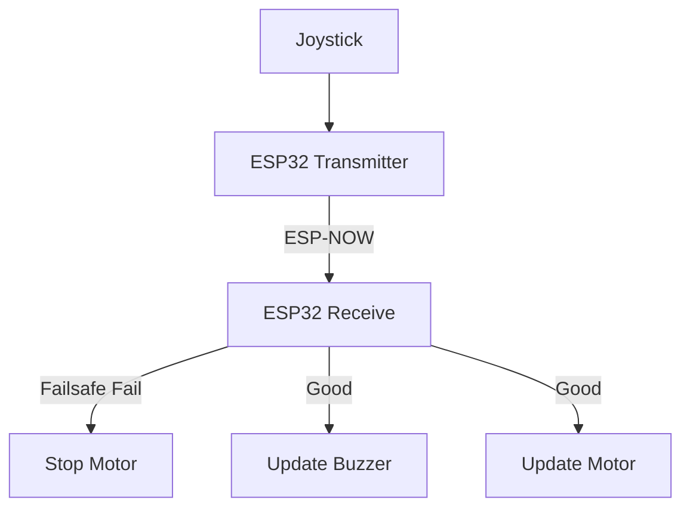

# **ESP32 Embedded Wireless Vehicle Control System**

    This project is to create a 4WD car wirelessly controlled by joystick using ESP-NOW communication

## **Hardware**
- 2 x ESP32
- Joystick module
- L298N motor driver
- 4 x DC 3-6V Motor with Tire Wheel
- 4 x AA 1.5V alkaline battery 
- Power bank
- Active Buzzer

## **Firmware**
- Language: C/C++
- IDE: Visual Studio Code
- Build Environment: PlatformIO
- Framework: Arduino
- Wireless Protocol: ESP-NOW

## **System Architecture**

The system consists of 2 ESP32: a Transmitter and a Receiver

1. **ESP32 Transmitter**   
   - Read Joystick input
   -  Manipulate input values and apply deadzone filtering to calculate leftSpeed and rightSpeed
   - Send data wirelessly to ESP32 Receiver using ESP-NOW

2.  **ESP32 Receiver**
    -  Receive data from Transmitter
    -  Apply failsafe logic to immediately stop the car when the connection is lost
    -  Output values to motor driver and buzzer
  

3. **Data Flow**




## **File System Organization**

```
esp32-embedded-vehicle-control-system/
├──Shared_Lib/
|  └──ControlData/include/ControlData.h
├──Transmitter/
|   ├──include/GPIO.h
|   ├──lib/
|   |   ├──Joystick
|   |   |   ├──include/Joystick.h
|   |   |   └──src/Joystick.cpp
|   |   └──ESPNOW
|   |   |   ├──include/ESPNOWTrans.h
|   |   |   └──src/ESPNOWTrans.cpp
|   ├──src/
|   |   ├──GPIO.cpp
|   |   └──main.cpp
|   ├──.gitignore
|   └──platformio.ini
├──Receiver
|   ├──include/GPIO.h
|   ├──lib/
|   |   ├──Buzzer
|   |   |   ├──include/Buzzer.h
|   |   |   └──src/Buzzer.cpp
|   |   ├──ESPNOW
|   |   |   ├──include/ESPNOWReceiv.h
|   |   |   └──src/ESPNOWReceiv.cpp
|   |   ├──Failsafe
|   |   |   ├──include/Failsafe.h
|   |   |   └──src/Failsafe.cpp
|   |   ├──Motor
|   |   |   ├──include/Motor.h
|   |   |   └──src/Motor.cpp
|   ├──src/
|   |   ├──GPIO.cpp
|   |   └──main.cpp
|   ├──.gitignore
|   └──platformio.ini
├──docs/
|   └──pinout.md
├──.gitignore
└──README.md
```
